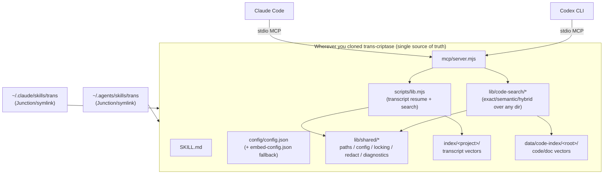

# Architecture

One codebase, one MCP server, one config, one pair of index namespaces, two independent client registrations.



## Module boundaries

| Layer | Owns | Does not own |
|---|---|---|
| `SKILL.md` | when to trigger, which retrieval mode, fallback order, answer formatting rules | actual index/search implementation |
| `mcp/server.mjs` | stdio JSON-RPC protocol, tool registration, argument pass-through | prompt logic (that's `SKILL.md`) |
| `scripts/lib.mjs` (transcript) | parsing `~/.claude/projects/*.jsonl`, index build/query | which client is calling |
| `lib/code-search/*` | indexing/searching an arbitrary `root_path` | re-implementing embedding/chunking/RRF (reuses the proven pure functions from `scripts/lib.mjs`) |
| `lib/shared/*` | path resolution priority chain, config merge, file locking, redaction | any retrieval business logic |
| `install.ps1` / `.sh` | environment probing, Skill Junction/symlink creation, MCP registration, idempotency | rewriting a user's existing `apiKey` |

## Path resolution priority chain

Two distinct concepts, resolved by two different functions in `lib/shared/paths.mjs` — do not conflate them:

- **`INSTALL_ROOT`** (where trans itself lives, used to find config/index): derived from `lib/shared/paths.mjs`'s own file location (`path.dirname` × 3), same pattern the original `scripts/lib.mjs` already used for `SKILL_DIR`. Works no matter where the repo is cloned.
- **`resolveProjectRoot(explicit)`** (which directory the user is asking about, e.g. `trans_code_query`'s default `root_path`): explicit argument → `CLAUDE_PROJECT_DIR`/`CODEX_PROJECT_ROOT` env var → `process.cwd()`.

## Concurrency and data integrity

- Index writes: temp file + `fs.renameSync` atomic replace (`lib/shared/locking.mjs`).
- Concurrent index builds: `data/*/<index-key>/state.json.lock` (PID + timestamp; stale after 10 minutes, auto-reclaimed).
- Both clients run independent MCP processes; read-only queries are naturally concurrency-safe; index-building paths are mutually exclusive via the lock.

## Security boundary (code-search subsystem)

```
trans_code_query/read/index's root_path/path
  → path.resolve normalization
  → reject ".." traversal
  → fs.realpathSync validates the real physical location still sits inside allowedRoots (if configured)
  → ignore rules (built-in baseline + .transignore additions, baseline cannot be removed) filter secrets/binaries/oversized files
```

## Deliberate deviation from the original tool-naming scheme

The original design brief used `trans_query`/`trans_index`/`trans_read`/`trans_status`/`trans_config_check`. Because `trans_index` (and implicitly `trans_query`) were already taken by the transcript-resume subsystem shipped in this repo, the new code-search tools use a `trans_code_*` prefix instead — preserving 100% backward compatibility for the 6 existing transcript tools rather than reusing/overloading their names. See `Goal.md` §2 for the full rationale.
