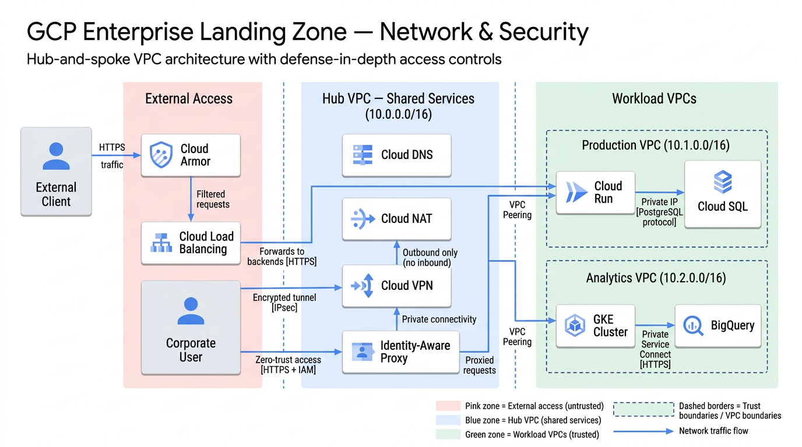
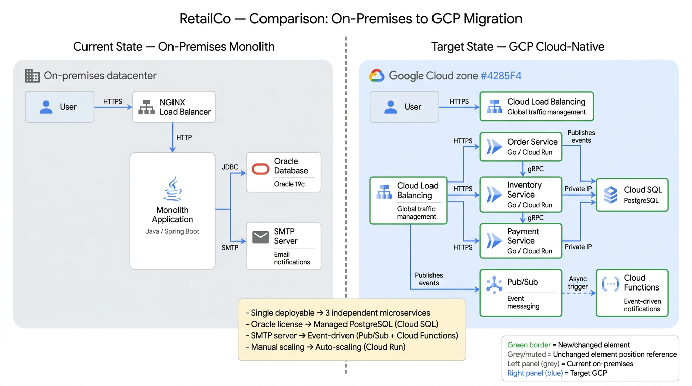
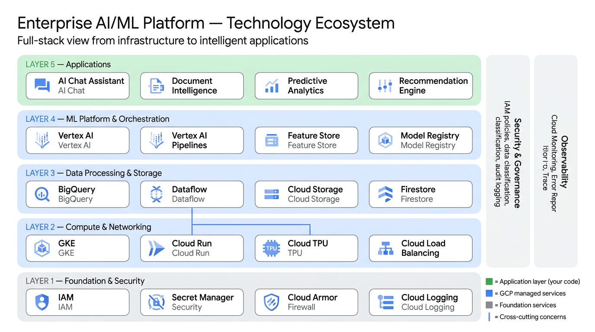

# tech-diagrams

Generate publication-quality technical diagrams using Gemini image generation. Works across Claude Code, Cursor, Copilot, Windsurf, Continue, Aider, Roo Code, and any tool that supports Agent Skills.

## What it does

Takes a natural language description of a system and produces a polished, publication-ready PNG diagram. The skill reads your codebase and architecture docs, selects the right diagram type and visual style, composes a detailed prompt with spatial layout instructions, auto-injects matching brand icons from a 536-icon library, and generates the image via Gemini's native image generation.

## Supported diagram types

- **C1 System Context** — system + external actors/systems
- **C2 Container** — internal deployable units grouped by concern
- **C3 Component** — internals of a single container
- **Network & Security** — access paths, trust boundaries, private endpoints
- **Data Flow** — end-to-end request lifecycle with numbered steps
- **Sequence** — temporal orchestration between components
- **Use Case Map** — feature/capability matrix
- **Comparison / Split-Screen** — before/after, current/future, option A vs. B
- **Layered Ecosystem Map** — product positioning within a technology stack
- **Cyclical / Measurement Loop** — continuous process cycles (DevOps, FinOps)
- **Decision Tree / Flowchart** — question-driven selection flows
- **Deployment Topology** — where software runs on infrastructure
- **Concentric Rings / Containment** — layered protection or abstraction rings
- **Threat Model / Attack Surface** — attack vectors and mitigations

## Prerequisites

| Requirement | Details |
|-------------|---------|
| **ADC / Vertex** (recommended) | `GOOGLE_GENAI_USE_VERTEXAI=1`, `GOOGLE_CLOUD_PROJECT` — no API key on GCP |
| **or** `GEMINI_API_KEY` | Local dev via [AI Studio](https://aistudio.google.com/apikey) |
| `python3` | `scripts/build-request.py`, `scripts/generate.py` |

## Installation

### Claude Code

Clone into your skills directory:

```bash
git clone https://github.com/smwitkowski/tech-diagrams.git ~/.claude/skills/tech-diagrams
```

The skill auto-registers via `SKILL.md` and appears as `/tech-diagrams`.

### Cursor

Clone the repo into your project (or as a submodule), then the `.cursor/rules/tech-diagrams.mdc` adapter loads automatically when relevant.

```bash
git clone https://github.com/smwitkowski/tech-diagrams.git .cursor/tech-diagrams
```

Or copy `.cursor/rules/tech-diagrams.mdc` into your project's `.cursor/rules/` directory and adjust paths.

### GitHub Copilot

The `.github/instructions/tech-diagrams.instructions.md` file activates when working with diagram-related files. Clone the repo and copy the instructions file:

```bash
cp tech-diagrams/.github/instructions/tech-diagrams.instructions.md your-project/.github/instructions/
```

### Windsurf

The `.windsurf/rules/tech-diagrams.md` adapter activates on model decision. Clone and copy:

```bash
cp tech-diagrams/.windsurf/rules/tech-diagrams.md your-project/.windsurf/rules/
```

### Continue.dev

Copy the prompt file into your Continue configuration:

```bash
cp tech-diagrams/.continue/prompts/tech-diagrams.md ~/.continue/prompts/
```

Then invoke with `@tech-diagrams` in Continue.

### Aider

Add to your `.aider.conf.yml`:

```yaml
read: path/to/tech-diagrams/SKILL.md
```

### Roo Code / Generic Agent Skills

Any tool that reads `SKILL.md` or `AGENTS.md` at the repo root will pick up the skill automatically. Clone the repo and point your tool at it.

## Examples

All examples generated with `gemini-3.1-flash-image-preview`. Each prompt is in the corresponding `.prompt.txt` file in `examples/`.

### Network & Security — GCP Enterprise Landing Zone

Hub-and-spoke VPC architecture with Cloud Armor, IAP, VPN, and workload VPCs across three trust zones.



### Comparison — Monolith to Microservices Migration

Split-screen showing on-premises Java/Oracle monolith vs. GCP Cloud Run microservices with Cloud SQL and Pub/Sub.



### Layered Ecosystem — AI/ML Platform Stack

Five-layer technology stack from infrastructure to applications, with Vertex AI, BigQuery, GKE, and cross-cutting security/observability sidebars.



## Usage

Ask your AI coding assistant to create a diagram:

> "Create a C2 container diagram of our payment processing system"

The skill will:
1. Read your codebase to extract component names and relationships
2. Select the appropriate diagram type and visual style
3. Compose a detailed prompt with ASCII layout and spatial instructions
4. Auto-inject matching brand icons from the 536-icon library
5. Generate a publication-quality PNG via Gemini

Output is saved adjacent to the source document with a descriptive filename like `payment-c2-container.png`.

## Icon library

The `icons/` directory contains 536 verified brand icons across four providers:

| Provider | Directory | Examples |
|----------|-----------|----------|
| Google Cloud | `icons/gcp/` | Cloud Run, BigQuery, Pub/Sub |
| Azure | `icons/azure/` | App Service, Cosmos DB, Event Hub |
| AWS | `icons/aws/` | Lambda, DynamoDB, SQS |
| Material Design | `icons/google/material/` | Universal fallbacks (database, API, user) |

Icons are automatically matched and injected into Gemini requests by `scripts/build-request.py`, ensuring consistent brand logos across all generated diagrams.

## Gemini Enterprise remote agent (internal)

Hosting for the **Gemini Enterprise** A2A remote agent (Cloud Run, Terraform, CI) lives in the private **66degrees** repo — not in this public skill tree:

**[github.com/66degrees/tech-diagrams-agent](https://github.com/66degrees/tech-diagrams-agent)** (66degrees engineers only).

This public repository remains the **skill + icon library** consumed by that agent at a pinned git ref.

## License

[MIT](LICENSE)
