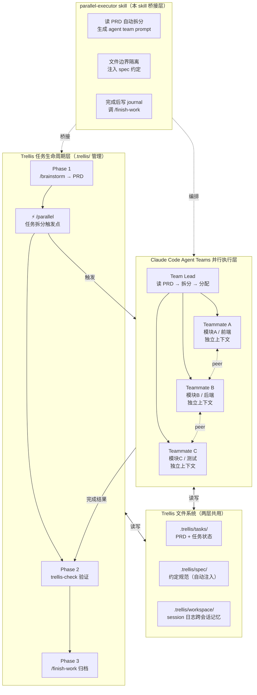

# Parallel Executor（Trellis + Agent Teams 融合版）

**定位：Trellis 管任务生命周期，Agent Teams 管并行执行，本 skill 是两者的桥接层。**

------

## Trigger check
This skill applies when the user has a large task that can be split into independent parallel workstreams managed by Trellis. If the task is sequential or small enough for a single agent — stop, use trellis-task-orchestrator instead.

## 与 Trellis 原生 skill 的分工（防冲突）

| 场景                  | 由谁处理                                    |
| --------------------- | ------------------------------------------- |
| 需求澄清 / 写 PRD     | `trellis-brainstorm`（不重复）              |
| 读 spec 准备编码      | `trellis-before-dev`（不重复）              |
| **拆任务 + 并行执行** | **本 skill**                                |
| 代码检查 / lint       | `trellis-check`（本 skill 在完成后调用它）  |
| 归档 + 写日志         | `/trellis:finish-work`（本 skill 提醒触发） |

## 整体架构图



------

## 阶段 0：前置检查

```bash
# 检查 Trellis
ls .trellis/tasks/ 2>/dev/null && echo "OK" || echo "先运行: trellis init -u your-name --claude"

# 检查 Agent Teams
grep -r "CLAUDE_CODE_EXPERIMENTAL_AGENT_TEAMS" ~/.claude/settings.json 2>/dev/null \
  || echo "未启用，将降级为 git worktree 方案"

# 查看当前活跃任务
python3 .trellis/scripts/task.py status 2>/dev/null
```

若有活跃 PRD → 读取 `.trellis/tasks/{当前任务}/prd.md` 作为拆分依据。 若无 PRD → 提示用户先运行 `/trellis:brainstorm`，或根据用户描述直接拆分。

------

## 阶段 1：读 spec + 生成接口约定

拆分前必须读 spec（与 `trellis-before-dev` 协同，不重复加载）：

```bash
cat .trellis/spec/backend/*.md 2>/dev/null | head -200
cat .trellis/spec/frontend/*.md 2>/dev/null | head -200
```

在项目根生成 `INTERFACE.md`（所有 teammate 启动时必须先读）：

```markdown
# INTERFACE.md — 并行执行接口约定
任务：{PRD 标题}   生成时间：{datetime}

## 模块边界（严格隔离，不得越界修改）
- Teammate A：{目录列表}
- Teammate B：{目录列表}
- Teammate C：{目录列表}

## 来自 .trellis/spec/ 的关键约定
{提取的规范要点}

## API / 数据格式约定
{统一格式，防止模块间不一致}
```

------

## 阶段 2：可行性判断

**适合并行（继续）：** 多模块独立开发、批量文件处理、多假设调试、跨层但接口已定义

**不适合并行（退出）：** 严格顺序依赖、同文件并发写入、简单任务、大量共享可变状态

------

## 阶段 3：拆分方案输出

```
━━━━━━━━━━━━━━━━━━━━━━━━━━━━━━━━━
任务：{PRD 标题}
Spec：已从 .trellis/spec/ 加载
并行度：{N} 个独立子任务
━━━━━━━━━━━━━━━━━━━━━━━━━━━━━━━━━

Teammate A：{角色}
  边界：{目录}  任务：{内容}  验收：{条件}

Teammate B：{角色}
  边界：{目录}  任务：{内容}  验收：{条件}

依赖：A、B 完全独立；C（可选）依赖 A 完成后启动
```

------

## 阶段 4：Agent Teams Prompt（直接复制使用）

```
创建 agent team 完成：{PRD 标题}

lead 启动前必读：
- INTERFACE.md（模块边界和接口约定）
- .trellis/tasks/{task}/prd.md（完整需求）
- .trellis/spec/{relevant}/（相关规范）

派生 {N} 个 teammate：

Teammate A：{角色名}
- 范围：{目录}（不得修改其他目录）
- 读取：.trellis/spec/{relevant}.md
- 任务：{具体内容}
- 完成后：运行 {测试命令}，在共享任务列表标记完成

Teammate B：{角色名}
- 范围：{目录}
- 读取：.trellis/spec/{relevant}.md
- 任务：{具体内容}
- 完成后：运行 {测试命令}，标记完成

协调规则：
- 开始时在共享任务列表认领任务
- 跨模块接口问题直接 peer 消息通知对方
- 不修改 INTERFACE.md 中已定义的接口格式

全部完成后，lead：
1. 运行 trellis-check 综合验证
2. 对比 prd.md 验收标准输出完成报告
3. 提示用户运行 /trellis:finish-work
```

------

## 阶段 5：监控

```bash
/tasks          # 查看所有 agent 状态
claude agents   # 打开 Agent View 面板（或按左方向键）

Shift+↑/↓  切换 teammate
Ctrl+T      查看共享任务列表
Enter       进入某 teammate session
```

------

## 阶段 6：Trellis 收尾（不跳过）

```bash
# 1. trellis-check 验证（调 Trellis 原生 skill）
# 2. 发现新约定则触发 trellis-update-spec
# 3. 写 session 日志
python3 .trellis/scripts/add_session.py
# 4. 归档任务
/trellis:finish-work
```

journal 自动写入 `.trellis/workspace/{developer}/journal-N.md`，包含： 并行方式、参与 teammate 数量、各模块完成情况、新增 spec 约定、遗留问题。

------

## 降级方案（Agent Teams 未启用）

```bash
# 创建 worktree（共享 .trellis/ 目录，Trellis 任务追踪仍然有效）
git worktree add ../task-frontend -b feat/{task}-frontend
git worktree add ../task-backend  -b feat/{task}-backend

# 后台启动（PRD 路径传给 agent 保持上下文）
cd ../task-frontend && claude --bg "实现前端部分，需求见 .trellis/tasks/{task}/prd.md"
cd ../task-backend  && claude --bg "实现后端部分，需求见 .trellis/tasks/{task}/prd.md"

# 监控 + 合并
claude agents
git checkout main && git merge feat/{task}-frontend feat/{task}-backend
/trellis:finish-work
```

------

## 项目定制模板

### 全栈功能（有 Trellis PRD）

```
创建 agent team 实现 .trellis/tasks/{日期}-{功能名}/prd.md 中的需求。

lead 读取：prd.md + spec/backend/ + spec/frontend/ + INTERFACE.md

派生 3 个 teammate：
- frontend-dev：src/views/ + src/components/，实现 prd.md 前端部分
- backend-dev：src/main/java/，实现 API，严格遵守 spec/backend/
- test-engineer：src/test/，验收标准见 prd.md 的 AC 章节

完成后 lead 运行 trellis-check，提示 /trellis:finish-work。
```

### 毕设场景（论文批量任务）

```
创建 agent team 并行完成论文任务（需求见 .trellis/tasks/{任务}/prd.md）：

派生 3 个 teammate：
- chapter-writer：{章节范围} 内容撰写 + 格式统一
- figure-generator：所有 draw.io 图表生成/更新（ER图、流程图、序列图）
- format-fixer：图表编号规范化 + 参考文献 + 字数统计

各 teammate 不修改对方文件。
完成后 lead 做一致性检查，提示 /trellis:finish-work。
```

### 研究实验并行（PISFM 场景）

```
创建 agent team 并行运行实验：

Teammate A：experiments/lucas/ 下运行预训练，结果写入 results/lucas.json
Teammate B：experiments/prosail/ 下验证数据预处理，结果写入 results/prosail.json
Teammate C：整理 workspace/ 日志，更新 README 实验结果表格

不得互相修改对方的 experiments/ 目录。
完成后 lead 汇总对比并更新 .trellis/tasks/ 任务状态。
```

------

## 设计约束（防冲突的底线）

1. **不替代 Trellis 原生 skill**：brainstorm / before-dev / check / update-spec 由 Trellis 负责
2. **不绕过 .trellis/tasks/**：并行任务必须有对应 task 目录，保持任务追踪完整
3. **spec 注入优先**：teammate 的约束来自 `.trellis/spec/`，不依赖 prompt 重复描述
4. **完成必须经过 trellis-check**：不允许跳过验证直接 finish-work
5. **journal 必须记录并行信息**：teammate 数量、完成情况、新约定都要写进去
